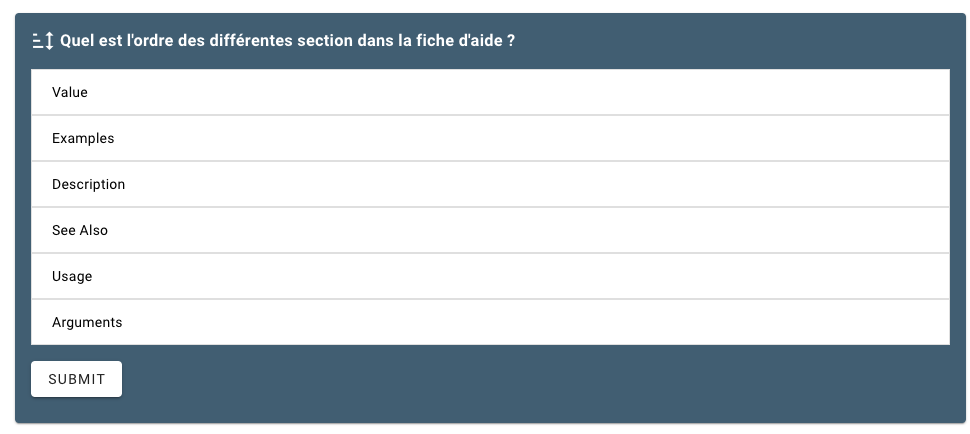

# Reaorder the proposition

## Goal

Ordering the various elements by drag and drop

## Code

```
::Sort
---
elements:
    - Description
    - Usage
    - Arguments
    - Value
    - See Also
    - Examples
question: "Quel est l'ordre des différentes section dans la fiche d'aide ?"
---
::
```

## Result

