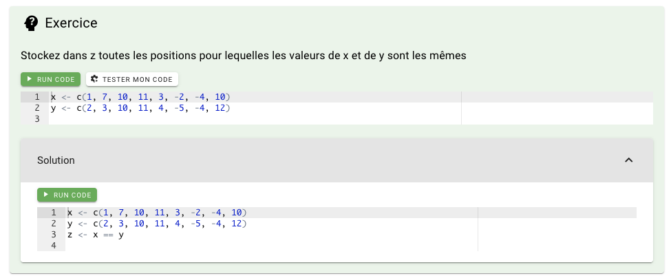

# Exerices

## Goal

Creation of an exercise area with the possibility of :

- Add a code section
- Add a method to check if the answer is correct
- Add a solution (show/hide)

## Code

```
::Exo
---
consigne: "Stockez dans z toutes les positions pour lequelles les valeurs de x et de y sont les mêmes"
code: |
    x <- c(1, 7, 10, 11, 3, -2, -4, 10)
    y <- c(2, 3, 10, 11, 4, -5, -4, 12)
test: "identical(z, c(FALSE, FALSE, TRUE, TRUE, FALSE, FALSE, TRUE, FALSE))"
solution: |
    x <- c(1, 7, 10, 11, 3, -2, -4, 10)
    y <- c(2, 3, 10, 11, 4, -5, -4, 12)
    z <- x == y
---
::
```

Code, test and solution are optionals.

!!! warning
    Test is only available for R at the moment


## Result

