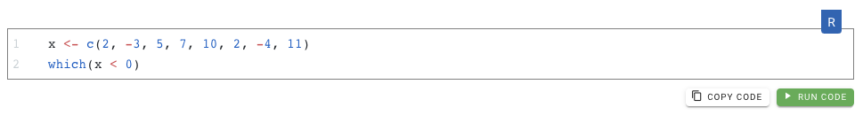

# Code

## Goal

Display code. This is a markdown enhancement.

## Code

```
    ```r
    plot(1,1)
    ```
```

You can add ```noRun``` (after ```r```) if you don't want to display the the run Button (for example when you share bash code).


## Result

